Here is a presentation of some of my projects. A few of them are open-sourced in this github account.

Si vous écrivez français et voulez en savoir plus, venez dire bonjour sur les forums de AmigaFrance ou AmigaImpact.

# IDE-RAM-A500
An expansion for the Amiga 500 and 500 plus computers providing the two things I believe it lacks the most : 2MB Fast RAM and one IDE port.

The RAM is configured by default as 2MB Fast autoconfig (in the 200000-9FFFFF space), and it can be turned into a 1.5MB (fast) RAM in ranger space (C00000-D7FFFF) together with 512KB MapROM. The modes and maprom can be configured by maintaining the reset from 3 to 10s or by using the provided Amiga software.

Facts about this project :
- It sits under the CPU : does not block access to the ROM and does not need a relocator.
- I wanted a mini-IDE port, this is the main reason why I started to create my own board.
- I thought that it would be neat to have some Fast RAM on the same 2-layers PCB, and I had a great SRAM chip for another project, PCMCIA-SRAM.
- The IDE port simulates the one from the A600 so it is bootable with appropriate Kickstarts. Like other IDE expansions, it requires two additional signals from the motherboard : INT2 and OVR.
- By default, the RAM stuff takes the place of the first expansion in the autoconfig chain. To use other autoconfig expansions, you need to configure the firmware with config_in/out pins to put it in your autoconfig chain.

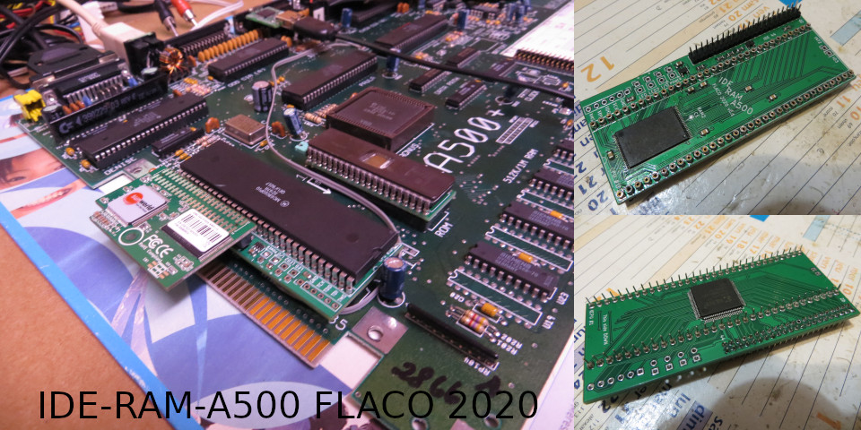

# CPC-RAMROMSDC
Upgrade the Amstrad CPC 464 computer with 512K RAM, 512K ROM and an emulated Floppy Disk Controller using SD-card.
- Plugs in the expansion port of the CPC464,
- Self-powered but can also be equipped with an external power jack, 
- Control panel with oled display for floppy operation, reset button, pause switch,
- DIP EPROM socket that acts as a ROMboard of up to 32x16K banks. Provides upper ROM7 for floppy operation (Amsdos, Parados), DIP switch to activate other upper ROMs, DIP switch to replace LOWER and BASIC ROMs (typically to upgrade to 6128 ROMs). ROMs are also addressable like on the Plus range so you can play CPR cartridges like ALCON2020 ! Support flashing from the CPC.
- 32x16K RAM banks, DIP switch to select operation mode (off, DK'tronics, 6128 compatible),
- Emulated FDC that can use .dsk images from a SD-card. Actually works with many amsdos/cracked disks.
  - Two drives
  - Write support
  - Also supports 80 tracks, double sided images, including Pinball Dreams, Orion Prime, Batman Forever.
  - Some protections support : weak sector, sectorsize8
- "selector" application for .dsk file selection from the CPC ; can be integrated inside Amsdos ROM or launched from floppy image.

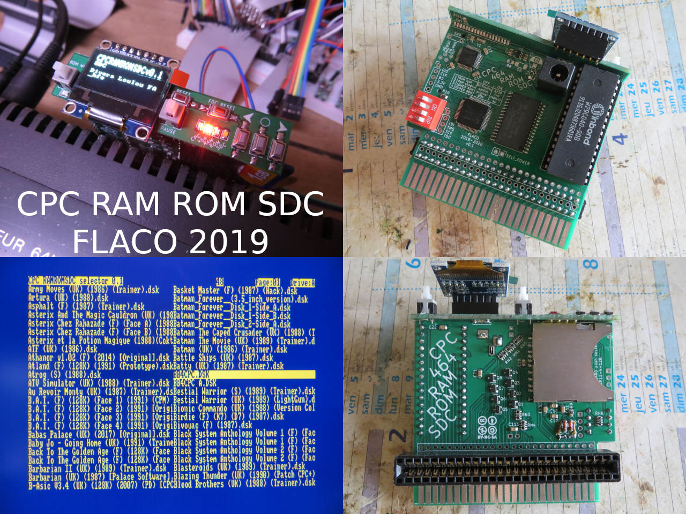

# Dual-USB-Controller-adapter
Interface board to connect two USB controllers to the two DB9 controller ports of an Atari ST/Amiga system. Supported USB devices : mouse, keyboard, xbox360 gamepad ; other HID controllers should also work but button placement is device dependant.

Working so far :
- two USB ports for two players games
- two DB9 outputs to the controller port of the Atari ST/Amiga
- DB9 input to daisy chain an Atari controller
- self-power or external power
- USB HID devices like mouse, keyboard or gamepad
- Wired XBOX 360 gamepad and HID gamepad support.
- CD32 buttons
- Autofire on right trigger
- 5 modes on XBOX360 gamepad
- single USB keyboard to replace two gamepads, but you can also use two keyboards

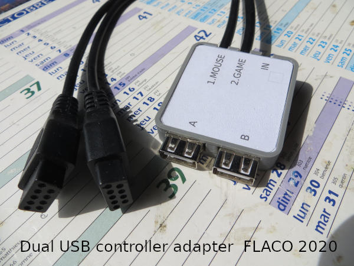

# Dual-USB-Controller-adapter-CPC
A version of the Dual USB Controller adapter project dedicated to the Amstrad CPC to connect two USB controllers on the DB9 joystick port. Supported USB devices : mouse, keyboard, xbox360 gamepad ; other HID controllers should also work but button placement is device dependant.

Working so far :
- two USB ports for two players games
- DB9 output plug to the joystick port of the CPC
- DB9 input to daisy chain an Atari controller
- Need external 5V 0.5A supply, WITH SAME GND AS THE CPC
- USB HID devices like mouse, keyboard or gamepad
- Mouse support with AMX compatibility
- Wired XBOX 360 gamepad and HID gamepad support. 3 buttons (button B is both on B and X, button 3 is on Y).
- Autofire on right trigger
- Auto-Left-Right on left trigger, for "sports" games :P
- platform mode with jump mapped on a button

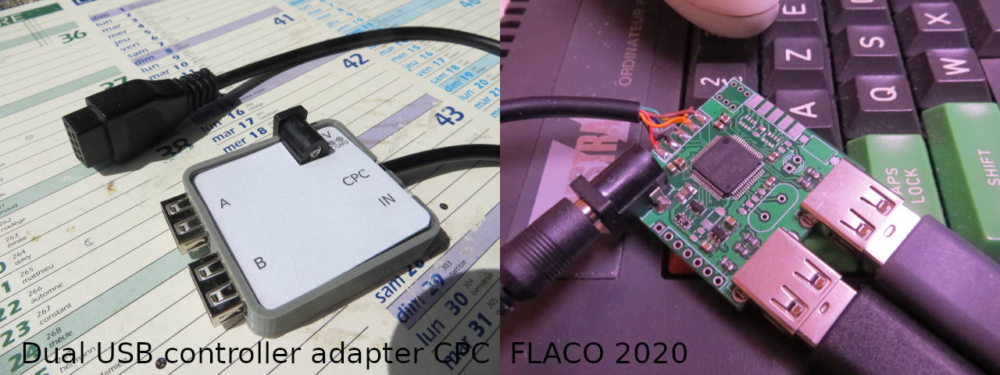

# USB-Controller-adapter
An interface board that connects a USB controller (mouse, keyboard, xbox360 gamepad ; other HID devices could be added) to a single or dual DB9 controller ports of an Atari ST/Amiga system. Prequel to the "Dual" versions, it is also more protected and more complicated to build.

# Amiga-USB-Keyboard-adapter
An adapter to plug a USB keyboard to an Amiga 500 internal keyboard connector or to the CD32/"big box" external connector.
- It supports Amiga keyboard communication through DATA and CLK lines, floppy LED, A500 hard reset, CD32 (and maybe big boxes) soft reset.
- It supports USB keyboards using the keyboard HID boot mode.
- It may be installed directly on the A500 keyboard connector of the motherboard.
- Revision 1.0 adds a game feature to control the joystick port using the keyboard, requires additional wiring.

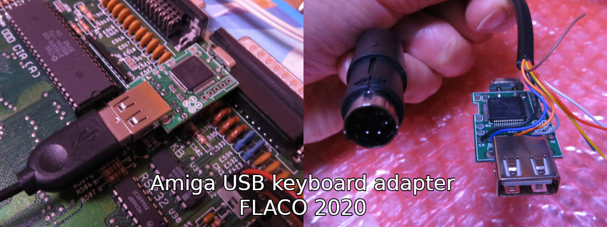

# Amiga-dual-floppy-selector
A device to connect two floppy drives inside an Amiga, identify them to the system, then choose which one is the DF0 to boot from. Its main purpose is to connect a physical drive and an emulator, but you can use two physical drives or two emulators if you want.

It proposes four alternatives :
- B=1, A=1 : Physical drive as DF0 only
- B=1, A=0 : Emulator as DF0 only
- B=0, A=1 : Physical drive as DF0 and emulator as DF1
- B=0, A=0 : Emulator as DF0 and physical drive as DF1

In addition :
- It may be plugged directly to the motherboard floppy header, thanks to its small size.
- It has a single connector for a ribbon cable to the floppies. You can also use my floppy emulator project that provides an output to daisy chain the other drive.
- There are two inputs, A and B. They can be connected either to a mechanical 2P4T switch, or to the selector output of my floppy emulator project.
- It requires the MTRX and the DRES signals. You may pick them up from the connector or from components on the board.
- Beware that you should not activate an external drive on the DB23 connector using the same id as an internal drive. When an external DF1 is connected, you should use "DF0 only" settings.
- If you permanently use external drives on the DB23 connector, you may wire another DS signal instead of DS1. The device has pin headers for that.

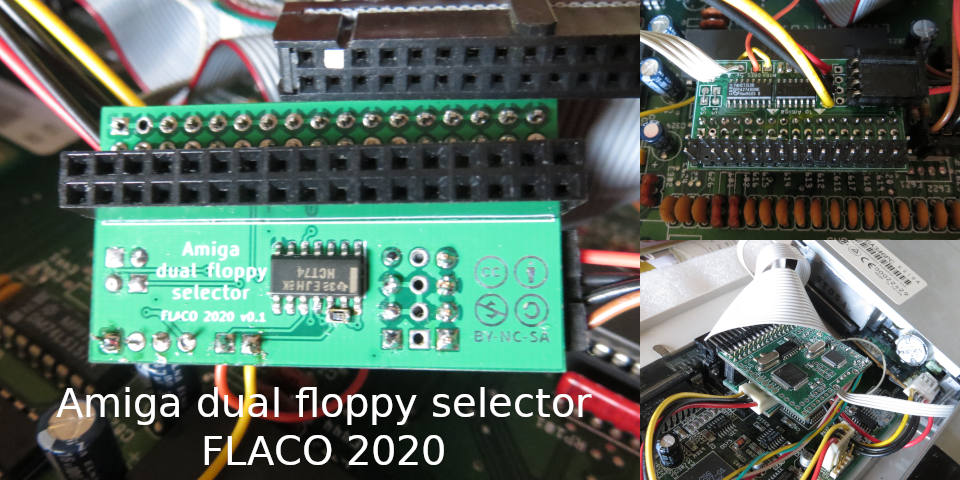

# Floppy-emulator-with-OSD
This can provide both [FlashFloppy](https://github.com/keirf/flashfloppy) and [FF_OSD](https://github.com/keirf/flashfloppy-osd) on a single board.
Thanks to the OSD and Amiga keyboard support, LCD/oled display or buttons are no longer necessary and the device can be almost completely hidden inside Amiga computers. It is still possible to install a display and buttons, though.

This board also has something special : when connected to an "Amiga dual floppy selector" board, it can daisy-chain to the original floppy drive, and the OSD will let you choose dynamically which drive is DF0 and DF1. Thanks to this you can enjoy both your original games on floppies and disk images on USB or SDcard !

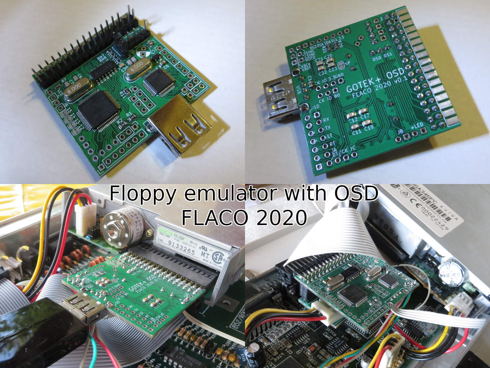

# A1200FaStRamExpansion
8MB autoconfig Fast SRAM and 1.5MB Ranger RAM trapdoor expansion for Amiga 1200, with 512KB kickstart mapROM.
- No waitstate thanks to the fast SRAM.
- The 8MB range is 32 bits wide. The 1.5MB and mapROM are 16 bits only.
- AmigaOS software to control the board (mapROM, PCMCIA compatibility)
- PCMCIA compatibility / 4MB autoconfig RAM : jumper for permanent setup, or via software for temporary setup.
- 2-layers PCB.

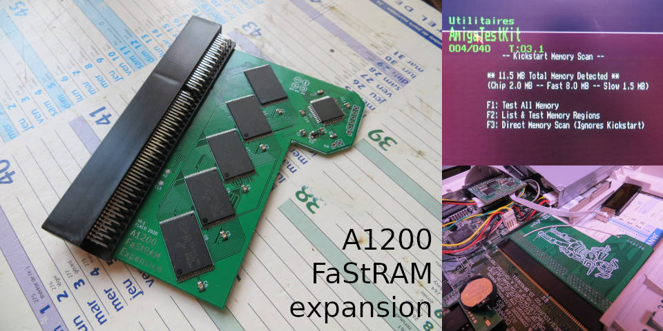

# PCMCIA-SRAM
A 4MB PCMCIA SRAM for Amiga 600 and 1200, using components available in 2020.

About the project :
- It works in A600 and A1200. It is not tested with any other device. It is 16bit only and does not implement 8bit mode that is required to be compliant to the PCMCIA standard.
- It is shorter than a regular PCMCIA card. It is thin enough to fit a standard PCMCIA case. You can fit it in the case and connector of a cheap and available PCMCIA CF adapter. 
- It uses components available in 2020. This is important since there have been several designs inspired by the Sakura board but many are obsolete. Reusing the connector and housing of a PCMCIA CF adapter is suggested.
- It uses a 5V SRAM chip so it does not need level converters. This RAM chip is pricey however, so you might chose to make a 2MB card using just one of it.
- The SRAM chip is fast and the CIS advertise the fastest speed possible. Thanks to this the A600 and A1200 runs faster : they benefit from the added RAM with direct access for the CPU, at least for 16bit applications on the A1200. 

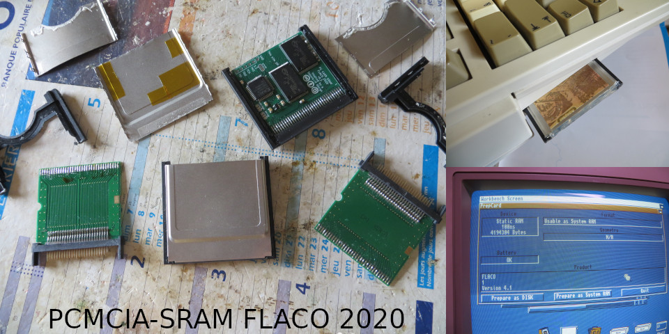

# AmigaWiFi
Three different RS232 WiFi boards with ESP8266 to connect the Amiga to the world with Zimodem or esp\_slip\_router firmwares.
- AmigaWiFi3232_external : plugs into the DB25 serial port. Provides TX/RX/RTS/CTS for communication and hardware flow control. Needs external 5V supply through micro or mini-USB.
- AmigaWiFi3232_internal : connects internally. Provides TX/RX/RTS/CTS for communication and hardware flow control.
- AmigaWifi3237 : plugs into the DB25 serial port. Provides TX/RX/RTS/CTS/DTR/DSR/DCD/RI for communication, hardware flow control, carrier detect, ring. Needs external 5V supply through micro or mini-USB.

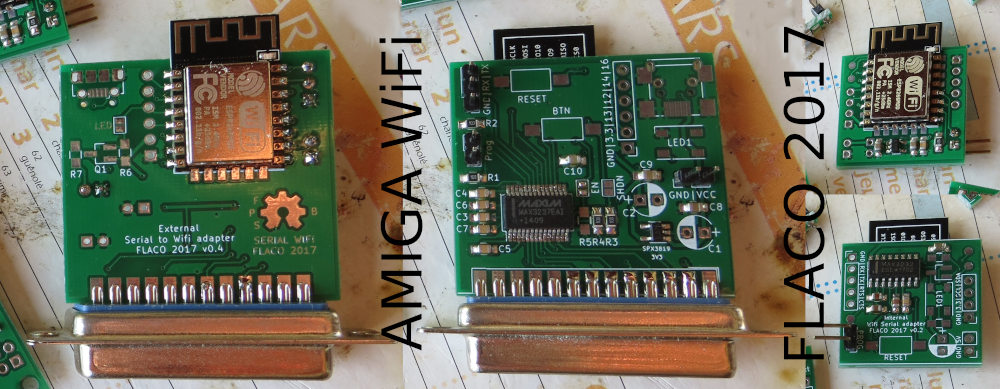

# CPC-plus-cartridge
Different PCB designs and CPLD code to make a CPC-plus cartridge.
- The ZIF version has a ZIF socket for DIP32 ROM SST39SF040 or W29C040, and is longer than standard cartridges
- the PLCC version can be used with PLCC SST39SF040 ROMs and its size is more standard
- They both have jumpers to select 128k, 256k or 512K cartridge ROM banks

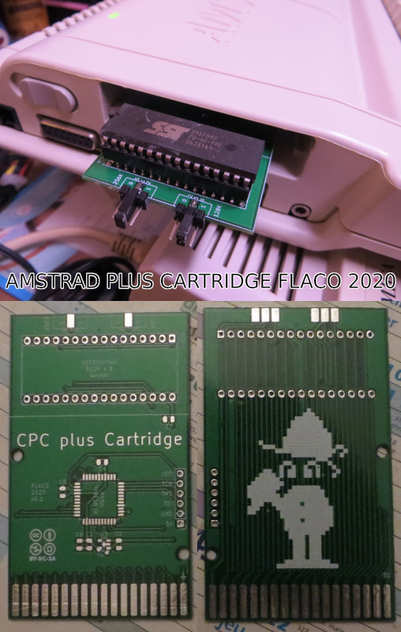

# PistormX
This Pistorm'X is a simplified [Pistorm](https://github.com/captain-amygdala/pistorm) CPU board, where all the logic is integrated inside a single XC94144XL-10TQ100 CPLD with 5V compatible IOs.
- This is even cheaper than the original board thanks to its single chip and 2-layer PCB.
- It is easier to assemble manually.
- I use it frequently and it seems to behave quite the same as the original CPU board according to my tests.

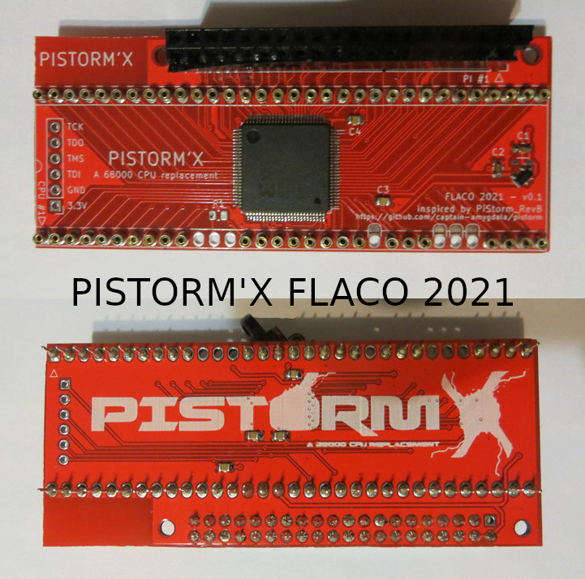

# Greaseweazle
The project is just a recreated [Greaseweazle](https://github.com/keirf/greaseweazle) "F1" board making use of the bare chips instead of a bluepill module, and designed to plug directly into a standard PC drive.
- It is small : it fits inside the 3.5" drive height and the ribbon width
- It is equipped with the female 34 pin connector to conveniently plug it in the drive, without a ribbon cable
- It connects to the PC with a micro USB cable
- It has a pass-through header for powering the drive (5v only). An external 5v/12v PSU is required only for drives requiring 12v or power hungry ones.
- It works with the original "F1" Greaseweazle firmware and tool
- It is updated to support the DISKCHANGE signal and to be able to report as a "F1 plus" board. This is necessary for the WinUAE FloppyBridge plugin by Robert Smith

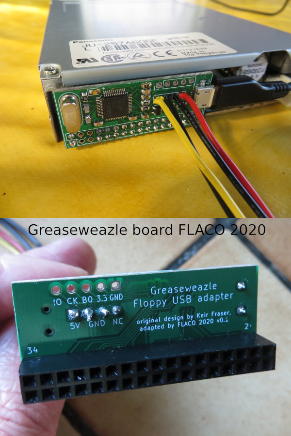

# SDbox
This is just a recreated [SDbox](https://github.com/jbilander/sdbox) board making use of the bare chips instead of breadboard modules.
- It is smaller
- It accommodates big SD cards instead of microSD
- It takes its power from a Mini or Micro USB or from a pin header

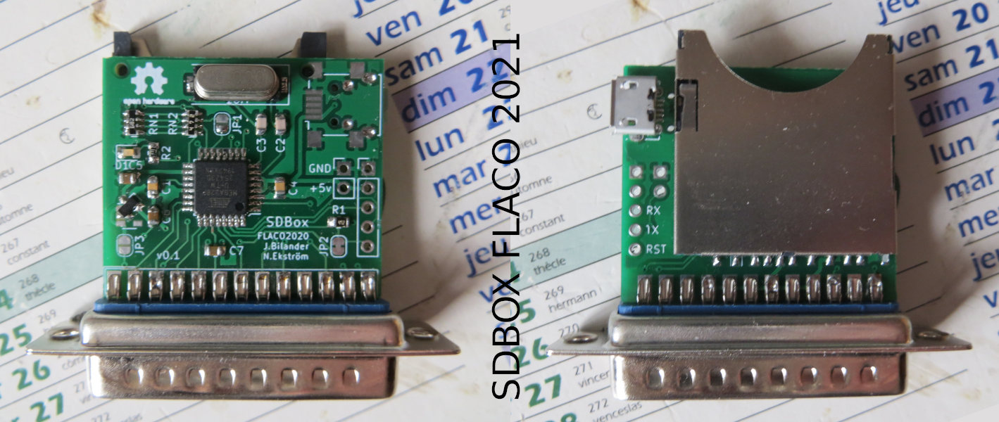

# CPCDandanator
This project is a personal version of the famous ["CPC Dandanator! Mini" by Dandare](http://www.dandare.es/Proyectos_Dandare/CPC_Dandanator%21_Mini.html).
- I wanted badly to try out "Sword of Ianna", so I built it on breadboard with the parts I had in stock :
- Flash ROM in DIP format,
- XC9572XL in VQ64 package (although Kicad files with VQ44 are also provided).
- On this PCB I used a crystal-less CH340E to reduce BOM. WARNING: serial/USB communication does not work for me

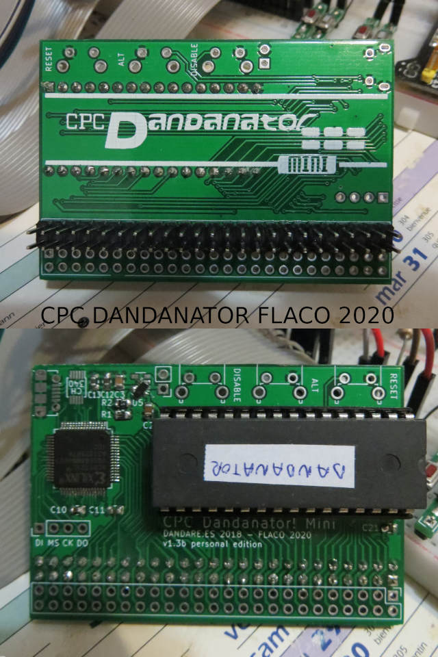

# Kickstart-programmer
27C400, 27C800, 27C160 or 27C322 adapter for TL866 and clones.

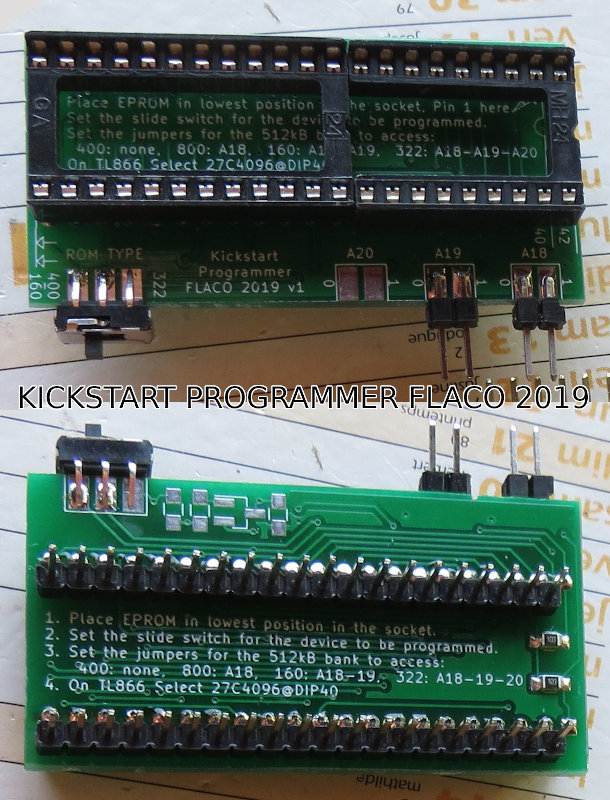

# Kickstart-selector
Use a 1MB 27C800 or 2MB 27C160 ROM chip prepared with 2 or 4 kickstart images, select which one to boot your Amiga from.

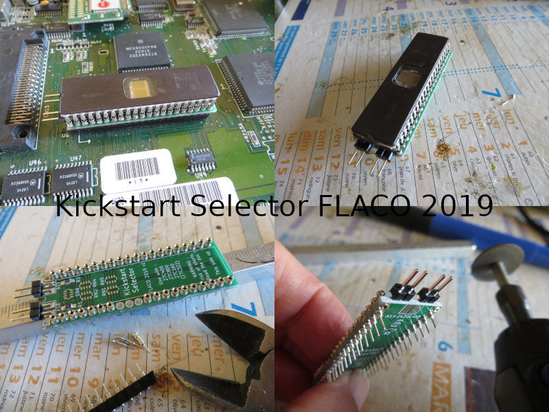

# OpenA1200RTC
[OpenA1200RTC](https://github.com/screwbreaker/OpenA1200RTC) is an Open Hardware RTC module for the Amiga 1200 by screwbreaker and Sukkopera. This project is a different layout of the board, with almost the same BOM :
- shorter pin header,
- no jumper to disable the board,
- footprint for CR1220 and wired cell in addition to the CR2032.

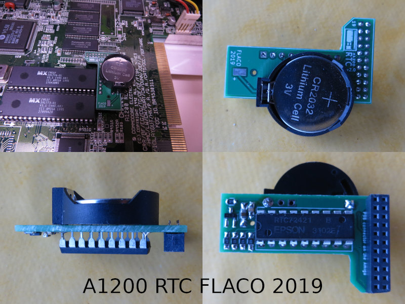

# OpenAmiga600RamExpansion
[OpenAmiga600RamExpansion](https://github.com/SukkoPera/OpenAmiga600RamExpansion/) is an Open Hardware 1 MB Chip RAM Expansion for the Commodore Amiga 600 Computer with optional Real Time Clock, by SukkoPera. This project is a different layout of the board, with almost the same BOM :
- smaller board, no space for ram chips sockets,
- inverted connector, so that components are facing downside and the solder joints do not touch the trapdoor,
- footprint for CR1220 in addition to the CR2032.

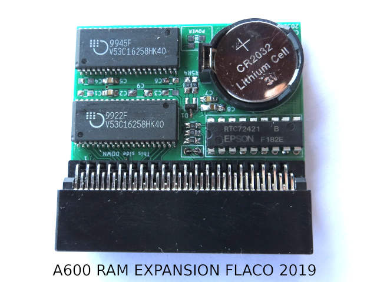

# About me
- CISO and DPO at a french IT company, ISO27001 auditor,
- Have been a product manager for years, Egineering degree in automation and production systems,
- Personal interest in hacking retro-computers using embedded electronics,

Transforming ideas into great products is a wonderful experience.

